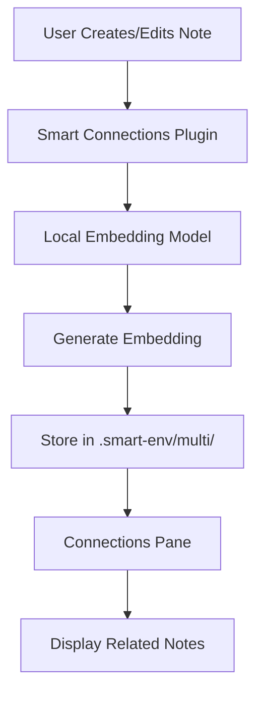

![[Connections pane screenshot 2024-10-28.png]]
## why
Linking relevant notes is a best practice in most personal knowledge management (PKM) systems. Unfortunately, this is a time consuming process and linking to all relevant content has many undesired side effects.

Similarly, tags can be helpful, but are also a time-consuming endeavor to maintain.

What if keeping track of notes was easier?

What if relevant content was easy to see without explicit linking?

Unlinked mentions is a useful strategy, one that's built-in to Obsidian, but it still falls short in surfacing relevant content when that content fails to use the exact text as the name of the note. 

The Connections pane in Smart Connections solves these issues through the use of embedding models. With embeddings, relevant content is surfaced without keyword matching.

![[smart-connections-pane-demo.gif]]
## usage
Embeddings are created automagically using a local model when the Obsidian Smart Connections plugin is installed.
The Connections pane can be opened from the command palette or <svg style="zoom:1.7;max-width:1.5rem;" viewBox="0 0 100 100" class="svg-icon smart-connections"><path d="M50,20 L80,40 L80,60 L50,100" stroke="currentColor" stroke-width="4" fill="none"></path>
    <path d="M30,50 L55,70" stroke="currentColor" stroke-width="5" fill="none"></path>
    <circle cx="50" cy="20" r="9" fill="currentColor"></circle>
    <circle cx="80" cy="40" r="9" fill="currentColor"></circle>
    <circle cx="80" cy="70" r="9" fill="currentColor"></circle>
    <circle cx="50" cy="100" r="9" fill="currentColor"></circle>
    <circle cx="30" cy="50" r="9" fill="currentColor"></circle></svg> button in the Obsidian ribbon. 
Results in the Connections pane may be expanded or collapsed individually. There is also an expand-all/collapse-all button at the top of the Connections pane.
## settings
### embedding models
Embedding model settings can be configured in the Obsidian settings community plugins section.

### filters
Filters are used to refine the results in the connections pane. The filter settings can be used to exclude/include notes based on the following parameters:
- specific keywords
- inlinks
- outlinks

## how it works diagram

