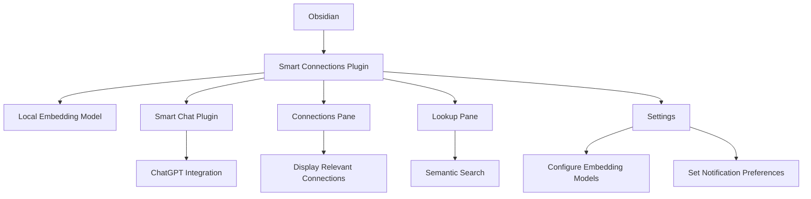

- Smart Connections is designed to work out-of-box
	- Notes are imported using a local embedding model as soon as you enable the plugin
	- This process often takes about a minute for one hundred notes
		- may vary based on notes & computer
- Open the Smart Connections view (<svg style="zoom:1.7;max-width:1.5rem;" viewBox="0 0 100 100" class="svg-icon smart-connections"><path d="M50,20 L80,40 L80,60 L50,100" stroke="currentColor" stroke-width="4" fill="none"></path>
    <path d="M30,50 L55,70" stroke="currentColor" stroke-width="5" fill="none"></path>
    <circle cx="50" cy="20" r="9" fill="currentColor"></circle>
    <circle cx="80" cy="40" r="9" fill="currentColor"></circle>
    <circle cx="80" cy="70" r="9" fill="currentColor"></circle>
    <circle cx="50" cy="100" r="9" fill="currentColor"></circle>
    <circle cx="30" cy="50" r="9" fill="currentColor"></circle></svg>) and begin browsing connections

#### Installing Smart Connections Obsidian Plugin
1. Open Obsidian.
2. Navigate to **Settings** > **Community Plugins**.
3. Click on **Browse** and search for **Smart Connections**.
4. Click **Install** and then **Enable**.
*Smart Connections will process notes locally when enabling the plugin for the first time. This usually takes about 1 minute per 100 notes (this can vary significantly based on the content of the notes and the computer's hardware).*

#### Setting Up Smart Connections
1. After installing the plugin, open Obsidian.
2. Navigate to **Settings** > **Smart Connections**.
3. Configure the settings as desired. **Default settings are suitable for most users.**

#### Setting up the Smart Chat
1. Click the gear icon in the top-right of the Smart Chat.
2. Select a chat model platform.
3. Add an API key for the chat model platform.
4. Select a chat model from the dropdown.

## overview diagram

